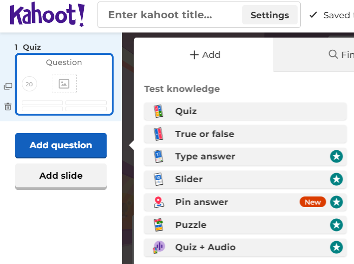
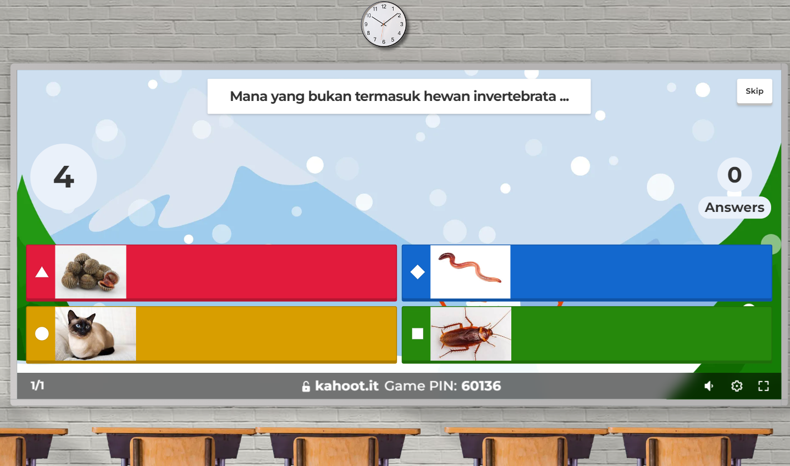
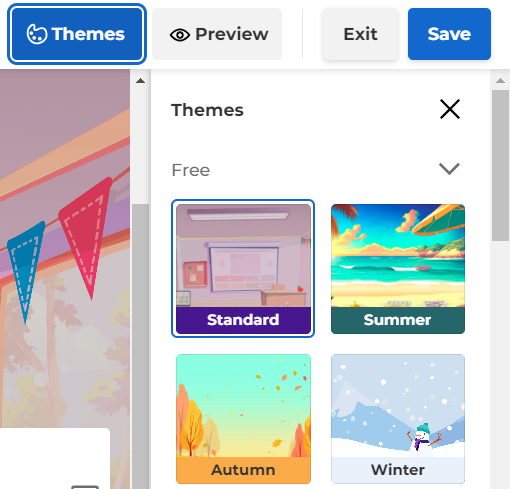

``` 
Nama        : Fatimah Azzahra Maulida
NIM         : 2110131220020
Mata Kuliah : Pengajaran Berbantuan Komputer
```

---
# <div style="text-align: center;"> Kahoot As Tools </div>

<div style="text-align: center;">
    
</div>


Kahoot adalah _platform_ pembelajaran berbasis permainan yang memungkinkan pengguna membuat, berbagi, dan memainkan kuis interaktif secara _online_. Pengguna dapat membuat kuis mereka sendiri atau memilih dari ribuan kuis yang sudah tersedia di _platform_. Kuis dapat terdiri dari berbagai jenis pertanyaan, seperti pilihan ganda, benar/salah, dan puzzle. 

<div style="text-align: center;">
    
</div>

Saat bermain, peserta akan melihat pertanyaan di layar mereka, dan mereka harus menjawab dalam waktu yang ditentukan untuk mendapatkan poin. Poin ini didasarkan pada kecepatan dan ketepatan jawaban. Kahoot sering digunakan di ruang kelas, rapat, atau acara sosial sebagai alat untuk menguji pengetahuan, meningkatkan keterlibatan, dan menciptakan suasana yang kompetitif namun menyenangkan.

<div style="text-align: center;">
    
</div>

Kahoot sebagai _tools_/alat pembelajaran memiliki beberapa fungsi utama yang signifikan. Dalam hal evaluasi pembelajaran, Kahoot memungkinkan guru untuk membuat kuis singkat yang membantu mengecek pemahaman siswa setelah mempelajari suatu topik. Dengan umpan balik instan, siswa dapat langsung mengetahui apakah jawaban mereka benar atau salah, sehingga mereka bisa segera mengidentifikasi konsep yang belum dipahami. Selain itu, guru dapat menganalisis data hasil kuis, baik secara keseluruhan maupun individu, untuk mengidentifikasi area yang perlu diperkuat.

Dalam konteks pembelajaran aktif, Kahoot mendorong siswa untuk berpartisipasi secara langsung dalam proses belajar dengan menjawab pertanyaan secara _real-time_, serta menciptakan kompetisi sehat yang dapat meningkatkan motivasi mereka. Beberapa fitur Kahoot juga memungkinkan siswa untuk bekerja sama dalam tim untuk menjawab pertanyaan. 

Kahoot juga menyediakan presentasi yang menarik melalui berbagai template dan fitur visual yang mempermudah pemahaman materi. Dengan fitur ini, presentasi tidak lagi bersifat satu arah, sehingga _audiens_ dapat terlibat langsung dengan materi melalui kuis. Kahoot juga menyediakan pilihan tema yang menarik yang bisa diterapkan.

<div style="text-align: center;">
    
</div>

Selain itu Kahoot juga mendukung pembelajaran berdiferensiasi dengan memungkinkan guru untuk membuat kuis dengan tingkat kesulitan yang berbeda, serta mengakomodasi berbagai mata pelajaran dan topik, sehingga sesuai dengan minat dan kebutuhan siswa.